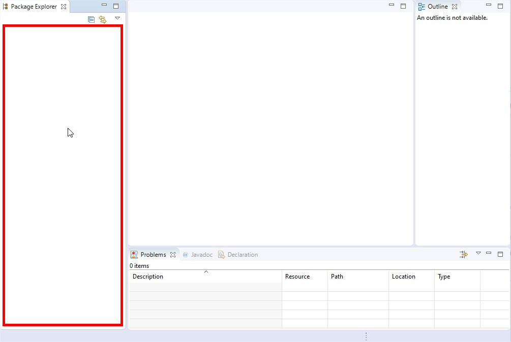
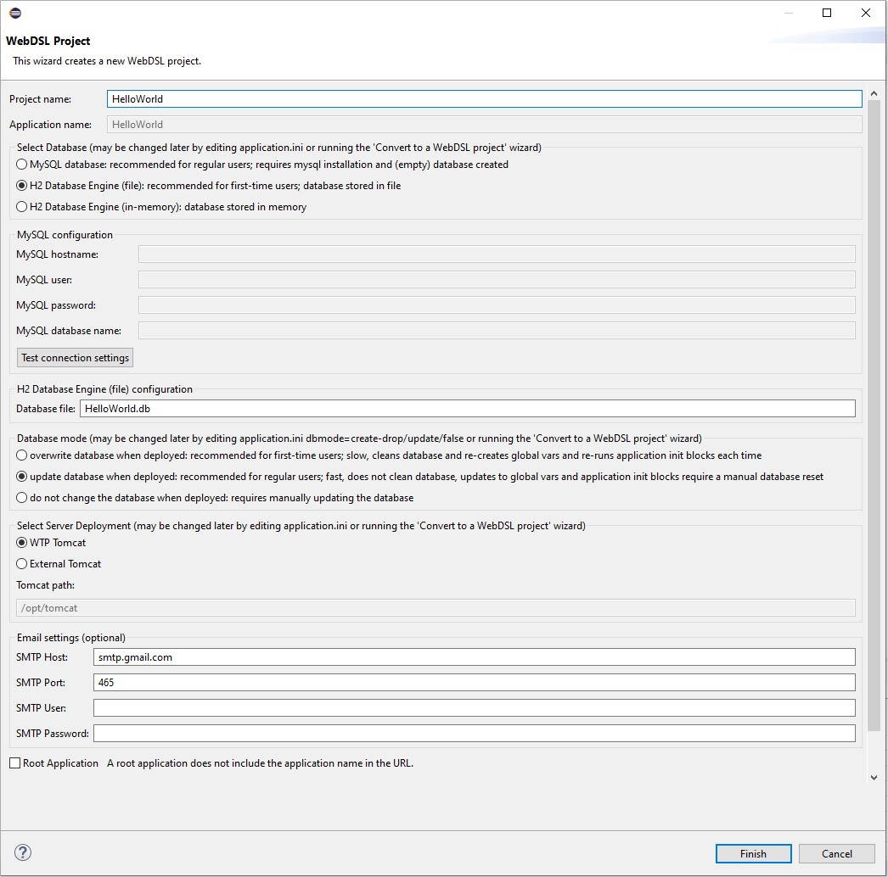
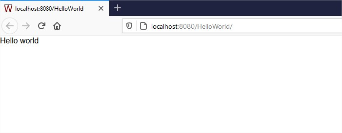

# Hello World

To create a Hello World application in WebDSL, we have to:

1. Create a WebDSL project;
2. Output Hello World on the root page;
3. Build and deploy the application.

## Create a New Project

{ align=right width=400}

Open the WebDSL editor and right-click the _Package Explorer_.

Select _New WebDSL Project_ to make the project configuration show up.</span>

<div style="clear: both;" />

{ align=right width=400}

Enter project name: `HelloWorld` and press _Finish_.

<div style="clear: both;" />

## Output Hello World on the Root Page

The generated project contains lots of files but we only need the main application file for this tutorial. Open `HelloWorld.app` in the root directory of the new project. It should look as follows:

```
application HelloWorld

  page root(){ "Hello world" }
```

## Build and Deploy the Application

To see the resulting web application in the browser, we have to compile and deploy the WebDSL code.

Navigate to the project directory in the terminal (e.g. `~/eclipse-workspace/HelloWorld/`). To compile and deploy the application in one command, execute `webdsl run`:

```bash
$ webdsl run
# This should start a local web server and generate the following output:
# ...
# [ Main | info ] stage 1: parsing HelloWorld.app         [ 0.78s ]
# ...
# [ Main | info ] stage 11: writing files                 [ 0.04s ]
# ...
# Now compiling generated Java code
# ...
# Some file copying
# ...
# Some SQL DROP/CREATE table statements
# ...
# Some Tomcat commands
# ...
# [XX <Month> XX:XX:XX HelloWorld] Tomcat web server started, your web application is available at http://localhost:8080/HelloWorld. Press ctrl+c to stop the web server.
```

<div style="clear: both;" />

{ align=right width=400}

Browsing to `http://localhost:8080/HelloWorld/` opens the root page of your application and should output _Hello world_ as we specified in `HelloWorld.app`.

<div style="clear: both;" />

## Summary

In this tutorial we created a web application with WebDSL, consisting of a single page that outputs _Hello world_.
